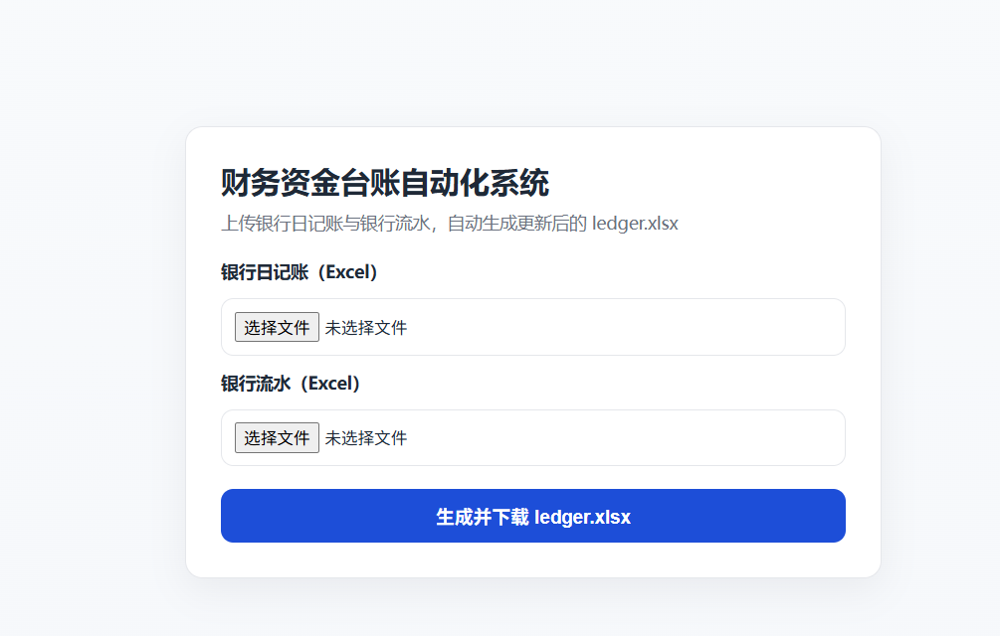

# Financial Ledger Automation

自动化更新资金台账系统。

## 功能

- 银行流水自动解析
- 项目自动识别
- 自动更新资金台账
- 自动生成历史备份

## 使用流程

1 复制银行流水到

data/raw/bank_flow.xlsx

2 运行

python run_pipeline.py

3 台账自动更新

data/processed/ledger.xlsx

## 网页版使用

1 安装依赖

```bash
pip install -r requirements.txt
```

2 启动网页服务

```bash
python app.py
```

3 打开浏览器访问

```text
http://127.0.0.1:5000
```

4 上传两个文件

- 银行日记账（台账文件）
- 银行流水

5 点击“生成并下载 ledger.xlsx”导出更新后的台账文件


## Render 部署

1 推送代码到 GitHub（确保包含 `data/config/project_map.xlsx`）

2 在 Render 新建 `Web Service`

3 连接你的 GitHub 仓库后，使用以下配置

- Build Command: `pip install -r requirements.txt`
- Start Command: `gunicorn app:app --bind 0.0.0.0:$PORT --workers 2 --threads 4 --timeout 120`

4 部署完成后，直接访问 Render 分配的 URL 即可上传并使用

说明：项目已增加 `render.yaml`，也可以在 Render 使用 Blueprint 自动读取配置部署。
